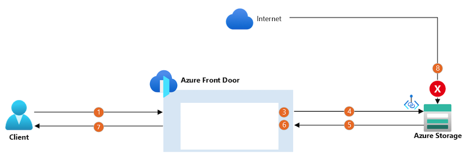

# Architecture

The data flows through the solution are:

- The client establishes a connection to Azure Front Door by using a custom domain name. The client's connection terminates at a nearby Front  Door point of presence (PoP).
- Sends the request to the origin storage account, wherever it is in the world, by using Microsoft's backbone network. The PoP connects to the storage account by using a separate, long-lived, TCP connection. In this scenario, Private Link is used to securely connect to the storage account.
- The storage account sends a response to the Front Door PoP.
- The PoP returns the response to the client.

# Usage
1. Install Terraform
2. cd terraform
3. terraform apply
